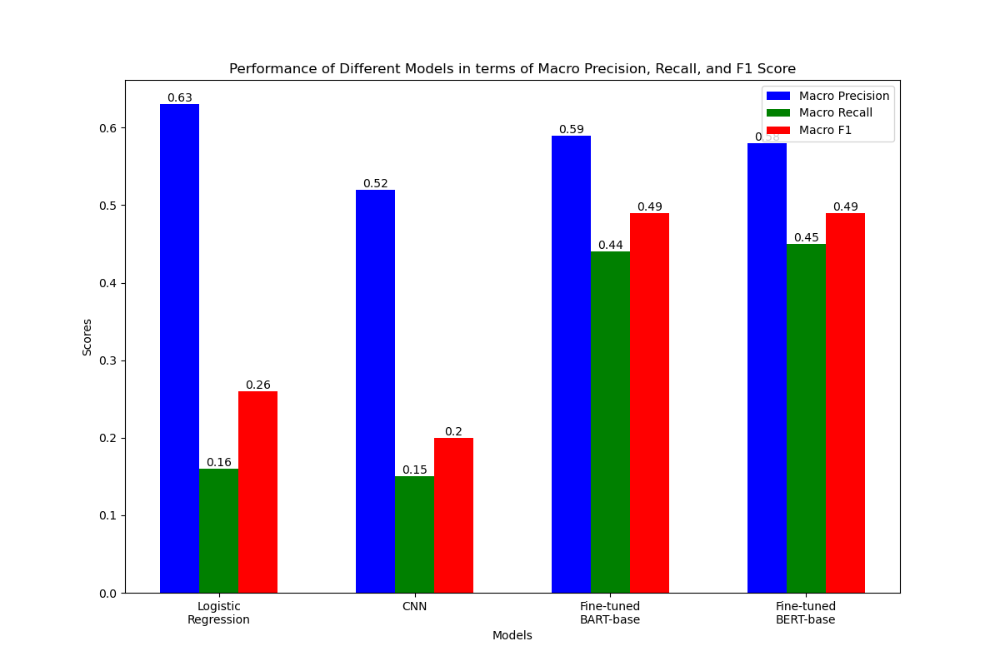

CS6120 Natural Language Processing Final Project

In this work, we aimed to develop a multiclass/multilabel classifier capable of analyzing text to detect the specific emotions conveyed, while also deepening the understanding of different models by comparing their performance. The proposed methodology leverages fine-tuning the pre-trained BERT and BART models using Google's comprehensive emotion dataset, GoEmotions, compromising of 28 distinct emotional categories. The dataset was also trained on logistic regression and convoluted neural networks, which acted as baseline models for this task.

Usage

```
git clone https://github.com/LileZzzz/CS6120-Final-Project.git 
```

Install requirements
```
pip install -r requirements.txt
```

# Model Performance

This plot shows the performance of different models in terms of Macro Precision, Recall, and F1 Score. All fine-tuning is done through Colab GPU.

